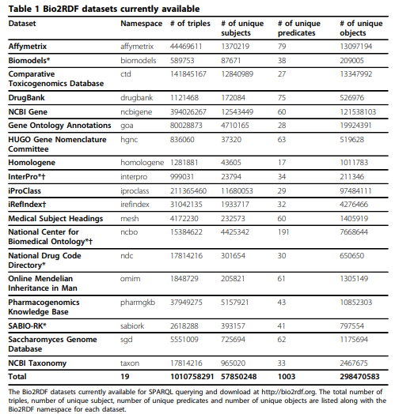
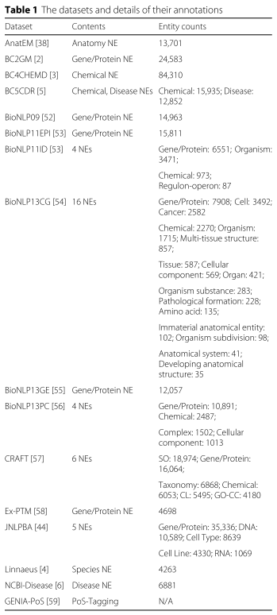
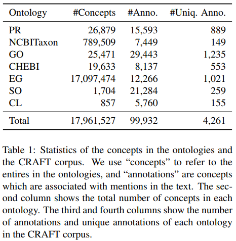
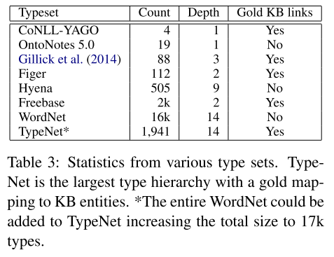
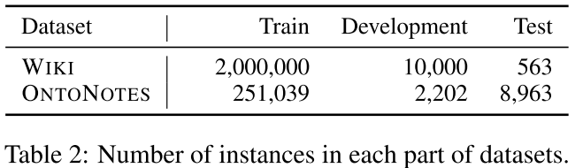

# Dataset pages
* If could, note for what purpose dataset was created

## Biomedical dataset overview

* Bio2rdf

  [link](http://download.bio2rdf.org/#/current)
    The latest release of Bio2RDF contains around 11 billion triples which are part of 35 datasets. written [here](https://jbiomedsem.biomedcentral.com/articles/10.1186/s13326-016-0111-z)

  statistics

  

 * [This papser](http://www.aclweb.org/anthology/W16-6112) summarizes datasets, including
   * KB
   * Corpus for training
   * Shared task
   * etc...


* Dataset overview (in *A neural network multi-task learning approach to biomedical named entity recognition* )
  

* Another dataset may be written in *Knowledge-driven Entity Recognition and Disambiguation in Biomedical Text*

## Corpus for biomedical domain
  * [here](http://www.trec-cds.org/2018.html)

## Ontologies and Knowledge base

* **[Chemical Entities of Biological Interest :ChEBI ontology](https://www.ebi.ac.uk/chebi/)*** contains more than 50,000 entites, written in [Analyzing user interactions with biomedical ontologies: A visual perspective](https://www.sciencedirect.com/science/article/pii/S1570826817300689)

* **Online Mendelian Inheritance in Man (OMIM)** at OMIM.org is the primary repository of comprehensive, curated information on genes and genetic phenotypes and the relationships between them. For more details, ,for example, see [this paper](https://academic.oup.com/nar/advance-article/doi/10.1093/nar/gky1151/5184722)

* **CentoMD**, a comprehensive and global genotype–phenotype database (Centogene's Mutation Database) that focuses primarily on human rare diseases.[paper](https://www.ncbi.nlm.nih.gov/pmc/articles/PMC5241210/)

* **CTD, KEGG, OMIM, BioGRID, Omnipath**, and **ChEMBL** are refferd in [this paper](https://arxiv.org/pdf/1812.00279.pdf)

* **the Cell Type Ontology (CL), the Chemical Entities of Biological Interest ontology (CHEBI), the NCBI Taxonomy (NCBITaxon), the Protein Ontology (PR), the Sequence Ontology (SO), the Entrez Gene database (EG)**, and **the Gene Ontology (GO)** are used for EL task in [this paper](http://aclweb.org/anthology/Q16-1011)

* CAS registry numbers, PubChem, ChEBI and CHEMBL are writtten [here](http://www.becalm.eu/files/material/CEMP_guideline.pdf)

  

* **PDD graph**

  * The gap between clinical data and biomedical knowledge graphs. [link](http://pdd.wangmengsd.com/)

## Entity linking
* **The Colorado Richly Annotated Full-Text** (**CRAFT**) corpus (Bada et al., 2012) is the largest gold standard corpus with high-quality annotations from multiple] KBs. For more details, see [this paper](http://aclweb.org/anthology/Q16-1011)

  * The expanded one is [here](Gold-standard ontology-based anatomical annotation in the CRAFT Corpus)

    * we have expanded the CRAFT Corpus with a large set of manually created semantic annotations relying on Uberon, an ontology representing anatomical entities and life-cycle stages of multicellular organisms across species as well as types of multicellular organisms defined in terms of life-cycle stage and sexual characteristics.

* **CoNLL-YAGO**  (Hoffart et al., 2011): the CoNLL 2003 shared task including testa of 4791 mentions in 216 documents, and testb of 4485 mentions in 213 documents.For more details, for example, see [this paper](./008_Neural_Collective_Entity_Linking).

* **TAC2010**  (Ji et al., 2010): constructed for the Text Analysis Conference that comprises 676 mentions in 352 documents for testin]g.

  * In [this paper](./008_Neural_Collective_Entity_Linking), they said that this dataset is a 'easy' case since it has only two mentions per document on avarage and high prior probabilities of correct candidates.

* **ACE2004**  (Ratinov et al., 2011): a subset of ACE2004 co-reference documents including 248 mentions in 35 documents, which is annotated by Amazon Mechanical Turk.

* **AQUAINT**  (Milne and Witten, 2008): 50 news articles including 699 mentions from three different news agencies.

* **WW**  (Guo and Barbosa, 2017): a new benchmark with balanced prior distributions of mentions, leading to a hard case of disambiguation. It has 6374 mentions in 310 documents automatically extracted from Wikipedia.

  * In [this paper](./008_Neural_Collective_Entity_Linking), they said that this dataset is a 'hard' case since it has the most mentions with balanced prior probabilities.

* **AIDA** is created by (Hoffart et al., 2011), which includes 1,393 docu- ments and 27,816 mentions referring to Wikipedia entries.For more detai, see [this paper](./009_Bridging_Text_and_Knowledge_by_Learning_Multi-Prototype_Entity_Mention_Embedding)

* **CoNLL** The CoNLL dataset is a popular NED dataset constructed by Hoffart et al.(Hoffart et al., 2011). The dataset is based on NER data from the CoNLL 2003 shared task, and consists of training, development, and test sets, containing 946, 216, and 231 documents,respectively.For more detail, see [here](https://arxiv.org/pdf/1601.01343.pdf)

* **MedMentions** is a corpus of 246K mentions from PubMed abstracts linked to the UMLS knowledge base. For more details, see [here](https://aclanthology.info/papers/P18-1010/p18-1010).
 See also BC5-CDR, NCBI-disease, BC-2GN Train, NLM-Citation GIA datasets, linked to UMLS ontologies.

  * NCBI focuses on mainly disease entries.

    [NCBI downloadable dataset](https://www.ncbi.nlm.nih.gov/guide/all/)

  * BC5-CDR(BCV-CDR) contains both chemicals and diseases.
    (BC5-CDR dataset is [here?](http://www.becalm.eu/) Still suspecting.)

  * BC2-GN and and NLM datasets both contain genes.

* ***Typenet*** aligns Freebase types with the WordNet hierarchy to obtain nearly 2k entity types. For more details, see [here](https://aclanthology.info/papers/P18-1010/p18-1010).

  * statistics

    

* **Microposts2014 / 2015 NEEL**
  The 2014 Microposts dataset (Cano et al., 2014) consists of 3,504 tweets extracted from a much larger collection of over 18 million tweets. The tweets were collected over one month in 2011. The 2014 Microposts challenge dataset was created to benchmark automatic extraction and linking entities.

* **AIDA-YAGO2, NEEL2014, NEEL2015, OKE2015, RSS500, WES2015, Wikinews** 's details are [here:Evaluating Entity Linking: An Analysis of Current Benchmark Datasets and a Roadmap for Doing a Better Job](http://www.lrec-conf.org/proceedings/lrec2016/pdf/926_Paper.pdf)

* [Survey on Challenges of Question Answering
in the Semantic Web](http://www.semantic-web-journal.net/system/files/swj1375.pdf) describes some models and datasets, combined with QA task.

* The **PHADERA corpus** is a semantically annotated corpus for pharmacovigilence (PV), consisting of 597 MEDLINE abstracts. Its fine-grained, multiple levels of annotation, added by domain-experts, make it a unique resource within the field, and aim to encourage the development/adaption of novel machine learning tools for extracting PV-related information from text. Details are [here](https://www.ncbi.nlm.nih.gov/pmc/articles/PMC6089860/)

* Gnormpluscorpus
  Gene/protein annotated corpus for Entity linking. Connected ontology is *Entrez gene*
  [paper](https://www.ncbi.nlm.nih.gov/research/bionlp/Tools/gnormplus/)

* The **BioC-BioGRID corpus** was developed that contained both biological entity annotations (gene/protein and organism/species) and molecular interaction annotations (protein–protein and genetic interactions (PPIs and GIs)).  [corpus link](https://academic.oup.com/database/article/doi/10.1093/database/baw147/2884890)

  * Linked gene ontology is *Entrez gene*

## Ontology Mappings
* UniProtKB

## NER.
* **BC5CDR** is from the most recent BioCreative V Chemical and Disease Mention Recognition task. It has 1,500 articles containing 15,935 Chemical and 12,852 Disease mentions.
  * Mention span and ID for KB is also annotated, so this dataset can be used for that of Entity Linking tasks.

* **NCBI-disease** focuses on Disease Name Recognition. It contains 793 abstracts and 6,881 Disease mentions.

* **LaptopReview** is from the SemEval 2014 Challenge, Task 4 Subtask 1 (Pontiki et al., 2014) focusing on laptop aspect term (e.g., “disk drive”) Recognition. It consists of 3,845 review sentences and 3,012 AspectTerm mentions.

* **WikilinksBED** dataset is a large-scale NED dataset of text fragments from the web, which is significantly noisier and more challenging than existing news-based datasets. Research in which this dataset is used is. for example, [here](./003_Effective_Use_of_Context_in_Noisy_Entity_Linking)

* **CADEC** consists of 1,250 posts from the medical forum AskaPatient. These posts were manually annotated by medical experts and a clinical ter- minologist for drugs, ADEs, diseases, symptoms, and findings. Among all 9,111 annotated entities, there are 1,800 drug entities and 6,318 ADE entities.  
see [Medication and Adverse Event Extraction from Noisy Text](https://aclanthology.coli.uni-saarland.de/papers/U17-1009/u17-1009)

* **i2b2 corpra** dataset focuses on the identification of medica- tions and medication-related information, such as their dosages, modes of administration, frequen- cies, durations, and reasons for administration, in discharge summaries.
see [Medication and Adverse Event Extraction from Noisy Text](https://aclanthology.coli.uni-saarland.de/papers/U17-1009/u17-1009), or other papers.

* **GENETAG** is a tagged corpus for gene/protein named entity recognition. See [this paper](https://www.ncbi.nlm.nih.gov/pmc/articles/PMC1869017/)


## Knowledge base/graph

* In **[Entity Linking: An Issue to Extract Corresponding Entity With Knowledge Base(2018)](https://ieeexplore.ieee.org/abstract/document/8246707)**, KB and EL datasets, beloging mainly to general domain, is described.

* **Crosswikis** : a dictionary computed from a Google crawl of the web that stores the frequency with which a mention links to a particular entity. see [here](./001_Entity_Linking_via_Joint_Encoding_of_Types,Descriptions,and_Context)

* **SNOMED-CT** is a medical knowledge base of 327,000 concepts. For example of use, see [Mapping Text to Knowledge Graph Entities using Multi-Sense LSTMs](https://aclanthology.coli.uni-saarland.de/papers/D18-1221/d18-1221)

* **reversed WordNet task** 's goal is to associate a multi-word definition to the correct lemma. For example of use, see [Mapping Text to Knowledge Graph Entities using Multi-Sense LSTMs](https://aclanthology.coli.uni-saarland.de/papers/D18-1221/d18-1221)

* **UMLS** has terminologies related to medical concepts, and, for example, [this](https://arxiv.org/abs/1807.03399) research uses its MRCONSO table as terminology vocabulaly. Its MRCONSO table has 3,5million entities, represented by 7.6 million strings in total.

  * [link](http://aclweb.org/anthology/W17-2305) でも詳細なUMLSについての言及がある。

* **[Drugbank database server](http://wifo5-03.informatik.uni-mannheim.de/drugbank/)** serves the DrugBank data in a structured format according to the Linked Data principles.


## Entity typing
* *WIKI* and *ONTONOTES* are well-establised and widely-used entity-typing dataset.



* Some NER corpus can be used for Entity typing task, since they have at least typing annotation.

## Text classification
* **Cora** dataset is for document classification. For example of use, see [Mapping Text to Knowledge Graph Entities using Multi-Sense LSTMs](https://aclanthology.coli.uni-saarland.de/papers/D18-1221/d18-1221)

## Abbreviation

* **Abbrev** dataset 3 developed by
Stevenson, et al. (Stevenson et al., 2009) contains examples of 300 ambiguous abbreviations found in MEDLINE that were initially presented by (Liu et al., 2001). For more detail, see [here](http://www.aclweb.org/anthology/W17-2334).

## Word Sense Disambiguation / Word Similarity

* **MSH-WSD** dataset 5 developed by (Jimeno- Yepes et al., 2011) contains 203 ambiguous terms and abbreviations from the 2010 MEDLINE base- line. For more detail, see [here](http://www.aclweb.org/anthology/W17-2334).

* **UMNSRS**(Pakhomov et al., 2010) datasets consists of pairs of UMLS concepts with judgments of similarity(566 pairs) and relatedness(587 pairs), as assignd by medical experts. For example of use, see [here(ACL2018)](http://aclweb.org/anthology/W18-3026) and [here(ACL2018)](http://www.aclweb.org/anthology/W18-2319)

* **WikiSRS** is a novel dataset of similarity and relatedness judgments of paired Wikipedia entities, created by [them](http://aclweb.org/anthology/W18-3026)
## Corpus

* **Medline** is a bibliographic database containing around 23 million ci- tations to journal articles in the biomedical do- main and is maintained by National Library of Medicine. The 2015 Medline Baseline encom- passes approximately 5,600 journals starting from 1948, and contains 22,775,609 citations, of which 13,835,206 contain abstracts.For more detail, see, for example, [here](http://www.aclweb.org/anthology/W17-2334).

## pretrained Embeddings
 * biomedical word2vec embeddings:[issue](https://github.com/RaRe-Technologies/gensim-data/issues/28),[issue](https://github.com/RaRe-Technologies/gensim-data/issues/5)

 * Bioasq pretrained data

 * Cambridge Bio word2vec data [link](https://github.com/cambridgeltl/MTL-Bioinformatics-2016)

   * [This paper](https://github.com/wonjininfo/CollaboNet) use this.

 * **[BioBert](https://github.com/dmis-lab/biobert)** contains wordpiece embeddings of bio-vocabularies.

   * For use, you have to preprocess target train/test corpus in a word-pieced manner.

## Mappings
Since there are so many ontologies, mappings is needed.

* [uniprot](ftp://ftp.uniprot.org/pub/databases/uniprot/current_release/knowledgebase/idmapping/README)

* [iproclass](ftp://ftp.pir.georgetown.edu/databases/iproclass/)

## Gene
* Entrez Gene [link](ftp://ftp.ncbi.nih.gov/gene/DATA/GENE_INFO/)

  * included data:
    ```
    #tax_id GeneID  Symbol  LocusTag        Synonyms        dbXrefs chromosome      map_location    description     type_of_gene    Symbol_from_nomenclature_authority      Full_name_from_nomenclature_authority   Nomenclature_status     Other_designations      Modification_date       Feature_type

    ```

### under surveying
Drugbank, Bio2RDF, OMIM, NCBI-Gene, KEGG,
PharmGKB, WCC, InterPro. iProClass, MEDIC
Freebase's entity description
